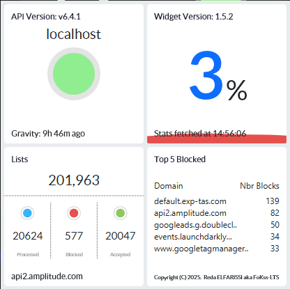
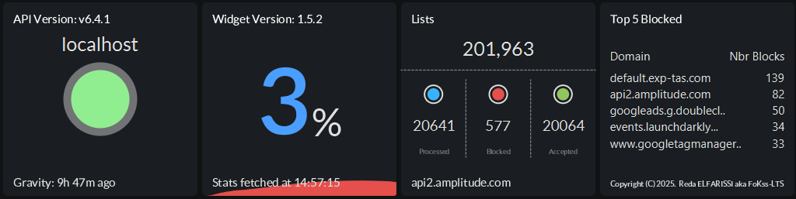
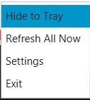
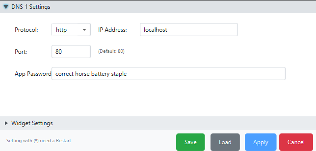
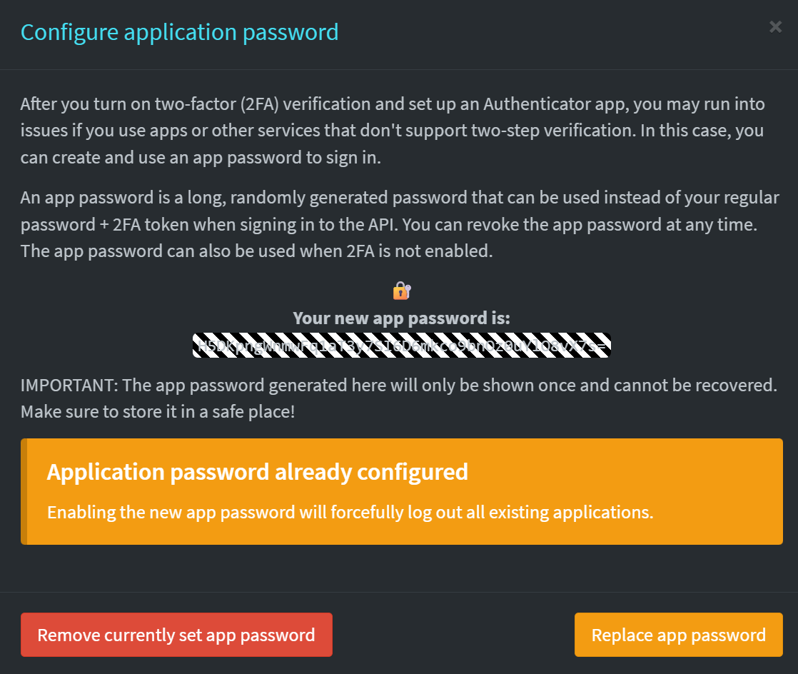
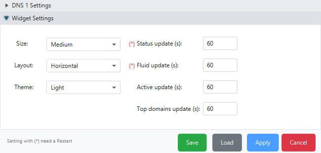

# <ins>Table of contents</ins>
- [Overview](#overview)
  * [Features](#features)
  * [Supported Platforms](#supported-platforms)
  * [Upcoming features](#upcoming-features)
- [Support](#donation)
- [Installation](#installation)
    * [Pre-Requisites](#pre-requisites)
    * [Installation Options](#installation-options)
    * [Configuration](#configuration)
      * [Where to find the API TOKEN](#where-to-find-the-api-token)
      * [Personalize your Widget](#personalize-your-widget)
    * [Running the widget](#running-the-widget)
- [Testing](#testing) 
- [Distribution](#distribution)
- [Credits](#credits)
- [License](#licence)

# <ins>Overview</ins>
## Pi-Hole DNS Widget for Desktop
DNSBlocker Widgets is a project I needed to make for my personal needs, and I decided to share it with you.

It is developed with JavaFX, and uses the framework TilesFX.

##### Screen Shots
###### <ins>Square</ins>


###### <ins>Horizontal</ins>


### <ins>Features</ins>

#### Core Features
- **Live stats from Pi-hole servers** - Real-time monitoring of your Pi-hole DNS.
- **Modern, customizable widgets** - Beautiful TilesFX-based interface.
- **Great summary** - All your Pi-hole DNS stats in one place.
- **Last blocked domain** - See what was blocked most recently.
- **Gravity update status** - Shows when gravity was last updated.

#### Themes & Customization
- **Dark and Light themes** - Switch between elegant dark mode and clean light mode.
- **Adjustable widget sizes** - Small, Medium, Large, XXL, or Full Screen.
- **Multiple layouts** - Choose between Horizontal and Square layouts.
- **Simple configuration interface** - Easy right-click access to settings.

#### System Tray Integration
- **Hide to tray** - Minimize the widget to system tray for a clean desktop.
- **Tray context menu** - Quick access to Show, Hide, Settings, and Exit.
- **Double-click to restore** - Easily bring back the widget from tray.

#### Pi-hole Control
- **Enable/Disable Pi-hole** - Toggle DNS blocking directly from the widget.
- **Refresh on demand** - Manual refresh option via right-click menu.
- **HTTP/HTTPS support** - Connect to your Pi-hole using secure or standard protocols.

#### Cross-Platform
- **Windows, macOS, and Linux support** - Native packages for all major platforms.
- **Portable distribution** - Windows portable ZIP requires no installation.
- **No Java installation required** - Java runtime bundled with all packages.

### <ins>Supported Platforms</ins>

| Platform | Installer Type | Minimum Version | Status |
|----------|---------------|----------------|--------|
| **Windows** | Portable EXE (app-image) | Windows 10 (64-bit) | ✅ Fully Supported |
| **macOS** | PKG | macOS 10.15 (Catalina) | ✅ Fully Supported |
| **Linux (Debian/Ubuntu)** | DEB | Ubuntu 20.04+ | ✅ Fully Supported |
| **Linux (Fedora/RHEL)** | RPM | Fedora 35+ | ✅ Fully Supported |

*All installers include bundled Java runtime - no separate installation required!*

### <ins>Upcoming features</ins>

- Support for AdGuardHome.
- Additional themes and color schemes.
- Update Gravity List

# <ins>Donation</ins>
All donations are welcome and any amount of money will help me to maintain this project :)
<p align="left">  
  <a href="https://paypal.me/foxinflames"></a>
</p>


# <ins>Installation</ins>

### Pre-Requisites

**For End Users (using installers):**
- None! Java runtime is bundled with all installers.
- Last version of Pi-hole running on your network.

**For Developers (building from source):**
- Java 25 JDK (set `JAVA_HOME` to your JDK 25 installation).
- Git (for cloning the repository).
- Platform-specific build tools (see [DISTRIBUTION.md](DISTRIBUTION.md) for details).

### Configuration
The widget automatically sets its configuration to the default pi-hole local address if that doesn't work , open the configuration interface by right clicking on the widget then click on Settings.



Then input your controllers IP Address/Port and the web password or generatedapp password, and click Apply.



###### Where to generate the App password


Enable Expert Settings 


then click  on configure app password




###### Personalize your widget

You can set your Widget size, layout, and theme by accessing the Widget configuration panel in Settings (Restart needed for some changes).



**Available options:**
- **Size:** Small, Medium, Large, XXL, Full Screen
- **Layout:** Horizontal, Square
- **Theme:** Dark, Light
- **Time to refresh:** Customizable

### Installation Options

#### Option 1: Download Pre-built Installers (Recommended)

Download the latest installer for your platform from the [Releases page](https://github.com/FoKss-LTS/PiHoleWidgets/releases):

- **Windows:** Download the Windows portable `.zip`, unzip it, and run `DNSBlocker Widgets.exe`
- **macOS:** Download and run the `.pkg` installer
- **Linux (Debian/Ubuntu):** Download the `.deb` file and install with:
  ```bash
  sudo dpkg -i DNSBlocker Widgets_*.deb
  ```
- **Linux (Fedora/RHEL):** Download the `.rpm` file and install with:
  ```bash
  sudo rpm -i DNSBlocker Widgets-*.rpm
  ```

All packages include the bundled Java runtime - no separate Java installation needed!

#### Option 2: Build from Source

All builds are done through Gradle commands directly:

```bash
# Clone the repository
git clone https://github.com/FoKss-LTS/PiHoleWidgets.git
cd PiHoleWidgets

# Build and test
./gradlew build test

# Run the application (without installer)
./gradlew run
```

**Create Platform Installers:**
```bash
# Windows portable ZIP
./gradlew portableZip -PinstallerType=app-image

# macOS PKG
./gradlew jpackage -PinstallerType=pkg

# Linux DEB (Debian/Ubuntu)
./gradlew jpackage -PinstallerType=deb

# Linux RPM (Fedora/RHEL)
./gradlew jpackage -PinstallerType=rpm
```

For detailed build instructions, see [DISTRIBUTION.md](DISTRIBUTION.md).

### Running the widget

After installation, launch DNSBlocker Widgets from:
- **Windows:** Start Menu > DNSBlocker Widgets, or run directly from the portable folder
- **macOS:** Applications folder
- **Linux:** Applications menu (under Network or Utilities)

**Context Menu (Right-click):**
- **Hide to Tray** - Minimize to system tray
- **Refresh All Now** - Manually refresh all data
- **Settings** - Open configuration window
- **Exit** - Close the application


**System Tray:**
When the widget is hidden to tray, you can:
- **Double-click** the tray icon to restore the widget
- **Right-click** for Show, Hide, Settings, and Exit options

# <ins>Testing</ins>

App has been tested on:
- **Windows 10 & 11** (64-bit)
- **macOS** (Catalina and later)
- **Linux Mint, Ubuntu, and Fedora**

Automated builds and testing are performed via GitHub Actions on all supported platforms.

If you find any bugs or want to suggest new features please go to: https://github.com/FoKss-LTS/PiHoleWidgets/issues

---

# <ins>Distribution</ins>

## For Developers & Distributors

This project includes comprehensive cross-platform build support:

**📚 Documentation:**
- **[docs/QUICKSTART.md](docs/QUICKSTART.md)** - Quick reference for users and developers
- **[DISTRIBUTION.md](DISTRIBUTION.md)** - Detailed build and distribution guide
- **[CHANGELOG.md](CHANGELOG.md)** - Version history and release notes
- **[docs/project_analysis.md](docs/project_analysis.md)** - Project analysis and improvement recommendations
- **[docs/DEPENDENCY_UPDATES.md](docs/DEPENDENCY_UPDATES.md)** - Dependency update management guide

**🔧 Build Commands:**
```bash
./gradlew build test                              # Build and test
./gradlew run                                     # Run the application
./gradlew portableZip -PinstallerType=app-image   # Windows portable ZIP
./gradlew jpackage -PinstallerType=pkg            # macOS PKG
./gradlew jpackage -PinstallerType=deb            # Linux DEB
./gradlew jpackage -PinstallerType=rpm            # Linux RPM
```

**🚀 CI/CD:**
- GitHub Actions automatically builds all platforms
- Tagged releases create installers for Windows, macOS, and Linux
- See `.github/workflows/build.yml`

---


# <ins>Credits</ins>
<div>
Shoutout to :

- <a href="https://github.com/HanSolo/tilesfx" title="hans0l0">hans0l0</a> for the project TilesFX.
 
- <a href="https://github.com/afsalashyana" title="afsalashyana">afsalashyana</a> for the helpful Covid Widget and JavaFX Tutorials.

</div>

# <ins>Licence</ins>
Copyright (C) 2022 - 2025.  Reda ELFARISSI aka FoKss-LTS


This program is free software: you can redistribute it and/or modify
it under the terms of the GNU General Public License as published by
the Free Software Foundation, either version 3 of the License, or
(at your option) any later version.

This program is distributed in the hope that it will be useful,
but WITHOUT ANY WARRANTY; without even the implied warranty of
MERCHANTABILITY or FITNESS FOR A PARTICULAR PURPOSE.  See the
GNU General Public License for more details.

You should have received a copy of the GNU General Public License
along with this program.  If not, see <https://www.gnu.org/licenses/>.         

Go back to : [Table of Content](#table-of-contents)
